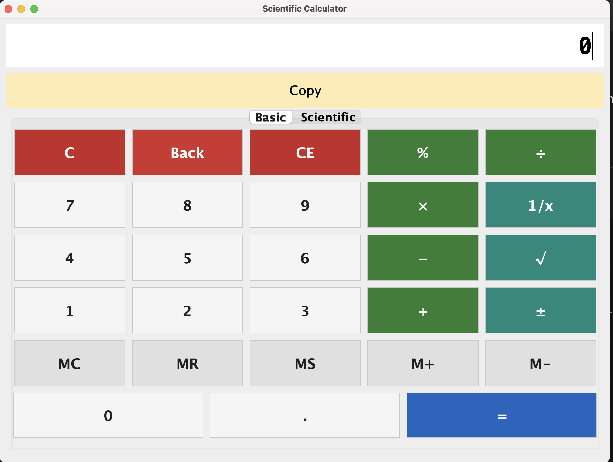
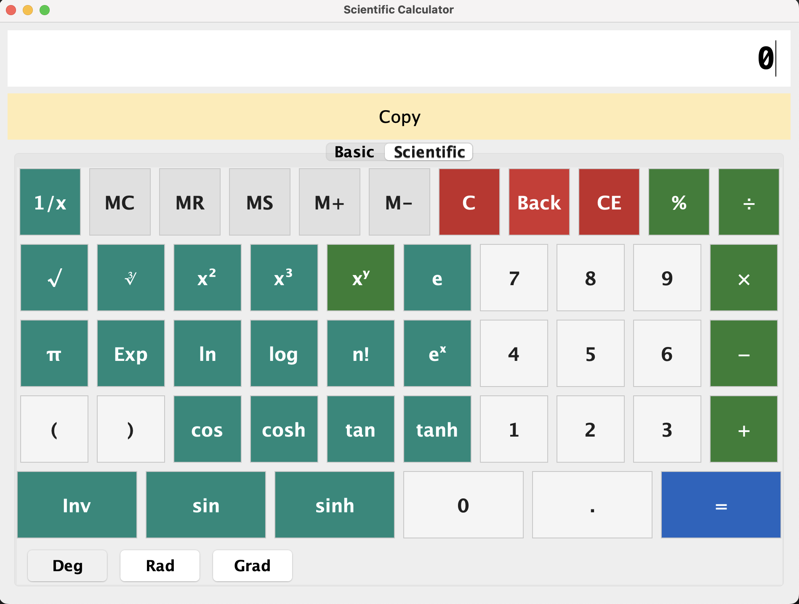

# Calculator Application (Java Swing)

This project is a desktop-based Scientific and Basic Calculator built using Java Swing.  
The application includes two modes (Basic and Scientific), a large and accessible user interface, and clearly color-coded buttons to resemble a real physical calculator.

---

## Screenshot




---

## Features

### Basic Calculator
- Addition, subtraction, multiplication, division
- Percentage operation
- Square root (`√`) and reciprocal (`1/x`)
- Sign toggle (`±`)
- Backspace, Clear Entry (`CE`), Full Clear (`C`)
- Memory storage functions:
    - `MC` — Clear memory
    - `MR` — Recall stored memory value
    - `MS` — Save current display to memory
    - `M+` — Add to memory
    - `M-` — Subtract from memory
- Large number display and large button layout for usability

### Scientific Calculator
- Trigonometric calculations: `sin`, `cos`, `tan` (with angle modes: Degrees, Radians, Grads)
- Hyperbolic functions: `sinh`, `cosh`, `tanh`
- Logarithmic functions: `ln`, `log`, `eˣ`
- Powers: `x²`, `x³`, `xʸ`
- Factorial: `n!`
- Constants: `π`, `e`
- Cube root: `∛`

---

## User Interface Design

- Buttons are color-coded for readability and faster recognition:
    - Grey for numbers
    - Green for arithmetic operations
    - Blue for equals (`=`)
    - Red for clear and deletion actions
    - Neutral grey for memory buttons
    - Teal for scientific and advanced functions

The layout aims to closely match the feel of a physical calculator while maintaining a clean and modern appearance.

---

## How to Run the Application

1. Make sure you have **JDK 17 or higher** installed.
2. Clone this repository:
   ```bash
   git clone https://github.com/Garima001011/Calculator-App-.git
